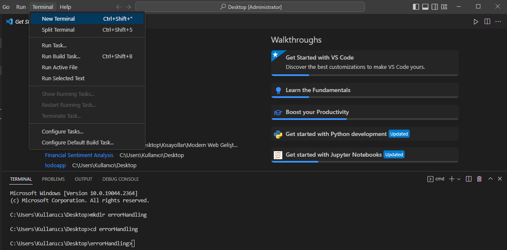
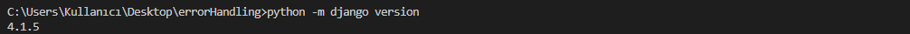
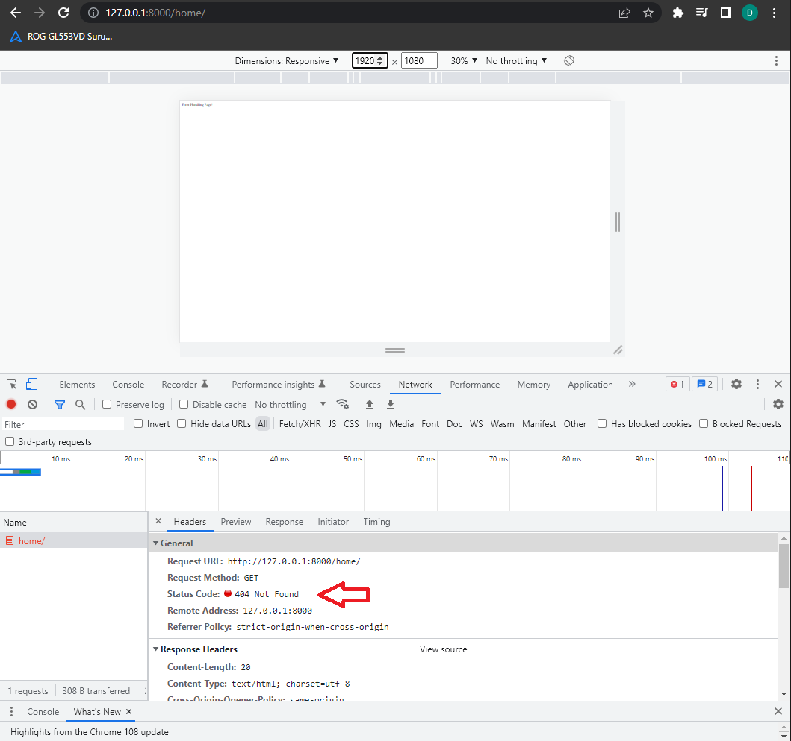

<h1 align=center>Django Handle Errors in Views</h1>

<small>Picture Source: <a  href="https://blog.thomasnet.com/industrial-website-404-error">blog.thomasnet.com</a></small>

 

<h2>Introduction</h2>

When navigating the web, it's common to occasionally enter a URL or click a link only to find that the page that you are looking for cannot be found. In this repository, you can learn how to handle errors and views using Django. In addition, you can generate your own custom 404 Not Found page using <code>django.http</code>.

<h3>404 Not Found</h3>

So, what is <i>404 Not Found</i> error? Internet is using <i>HTTP</i> to tranfer files to show you in browser. If the server could not find what you are looking for (<i>HTML</i> file or etc.), it will show up <i>404 Not Found</i> error. On the other hand, <i>404</i> is one of <i>HTTP status code</i>. <i>4xx status codes</i> are indicating <i>client errors</i>.  You can visit <a href='https://en.wikipedia.org/wiki/List_of_HTTP_status_codes' target='_blanc'>Wikipedia</a> to learn about <i>HTTP status codes</i>.

  

<h2>Building Django Project (with Windows Command)</h2> 

<h3>1. Prepare Environment for the Project</h3>

Before installation, we need to set up our environment for the project. For that, please follow the steps:

1. Open terminal in your code editor (I used VS Code):

Type or paste the following code lines on your teminal:

    mkdir errorHandling

Now, let's get into our folder to start our project.

    cd errorHandling

 

<h3>2. Prepare Virtual Environment</h3>

Virtual environment is a tool to create <b>isolated</b> Python environments. Virtual environment folder which contains all the necessary executables to use the packages that a Python project would need.

You can download virtual environment with the following code line. If there is, it will show you on terminal.

    pip install virtualenv

Now, all you need to do is type the following code to build your virtual environment for the project. After building it, you willl see <i>venv</i> folder in your <i>errorHandling</i> folder.

    python -m venv venv

We should active our <i>venv</i>. For that, please type: 

    .\venv\Scripts\activate

It's all done for our virtual environment!

 

<h3>3. Build Django in Virtual Environment and Project Files</h3>

We all set for building our project. Let's downlad <i>Django</i> into our <i>virtual environment</i>. It may take 8-9 seconds.

    pip install django

Now, let's check our <i>Django</i> verison.

    python -m django version

Done! Now we can use <i>Django framework</i> for our project! It's time to build project and app level folders and files. All we need to do is type following code lines. You can modify them but please don't forget, you may need to change paths in following files.

Let's start a project named <i>myproject:</i>

    django-admin startproject myproject

Now, we can build our app named <i>myapp</i> in project. Before that we should go into our project folder (where <i>manage.py</i> file locates).

    cd myproject
    python manage.py startapp myapp

Done!

 
 

<h3>4. Build Error Handling Project</h3>

<b>4. 1</b> From so on, we can build our project. Now, we need to create <i>urls.py</i> file as app-level (/myapp/urls.py). After that, please paste the following codes into <i>views.py</i> file:

<b>/myapp/views.py</b>

    from django.shortcuts import render
	from django.http import HttpResponse

	# Create your views here.
	def home(request):
	    return HttpResponse("Error Handling")

 

<b>4. 2</b> Now, we need to modify our <i>urls.py</i> file as app-level:

<b>/myapp/urls.py</b>

    from django.urls import path
	from . import views

	urlpatterns = [
	        path('', views.home, name="home"),
	]

 

<b>4. 3</b> Now we can build our <i>urls.py</i> file in project level. In <code>urlpatters</code>, we specified our myapp.urls file. 

<b>myproject/urls.py</b>

    from django.contrib import admin
	from django.urls import path, include

	urlpatterns = [
	    path('admin/', admin.site.urls),
	    path('', include('myapp.urls')),
	]

 

<b>4. 4</b> Now, we can update project-level <i>urls.py</i> with reference to the app-level URL configuration. To do that, all we need to do is add <i>myapp</i> into INSTALLED_APPS in <i>settings.py</i> file.

<b>myproject/settings.py</b>

    INSTALLED_APPS = [    
    'django.contrib.admin',    
    'django.contrib.auth',    
    'django.contrib.contenttypes',    
    'django.contrib.sessions',    
    'django.contrib.messages',    
    'django.contrib.staticfiles',    
    'myapp',    
    ]

<b>4. 5</b> In that file, we also have to change DEBUG parameter and allow for all the hosts for the error handling. We can change the default settings with changing DEBUG to False and ALLOWED_HOSTS to ['*'].

    DEBUG = False
    
    ALLOWED_HOSTS = ['*']

 

<b>4. 6</b> From now, we are done for our app-level folders. After doing all the steps correctly, we can create <i>views.py</i> as project-level (myproject/views.py). In project-level <i>views.py</i> file we can build functions with <code>HttpResponse</code> and <code>HttpResponseNotFound</code> from <code>django.http</code>.

<b>myproject/views.py</b>

    from django.http import HttpResponse, HttpResponseNotFound

	def handler404(request, exception):
	    return HttpResponse("404: Page not Found!")

	def home(request):
	    return HttpResponseNotFound("Error Handling Page!")

 

<b>4. 7</b> Now, we should update our project-level urls.py file before running our project. We can spesify <code>handler404</code> for 404 Not Found error in <i>urls.py</i> file.

<b>myproject/urls.py</b>

	from django.contrib import admin
	from django.urls import path, include
	from . import views

	urlpatterns = [
	    path('admin/', admin.site.urls),
	    path('', include('myapp.urls')),
	    path('home/', views.home),
	]

	handler404 = 'myproject.views.handler404'

We are done! Now, let's run our project and check on browser! We can check 404 Not Found error on <code>http://127.0.0.1:8000/home/</code> address. 

After that, we can check our custom error page with typing <code>http://127.0.0.1:8000/home/12</code> or etc. (unexciting file url).

 

<h2>Contact Me</h2>

If you have something to say to me please contact me:
 

<ul>
	<li>Twitter: <a  href="https://twitter.com/Doguilmak">Doguilmak</a></li>
	<li>Mail address: doguilmak@gmail.com</li>
</ul>
